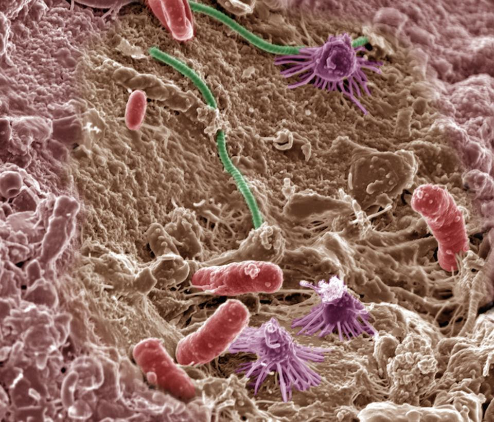

#### Hi, my name is Lily Fillwalk. I am a doctoral student at Rutgers University in Ecology & Evolution. I am currently working on a project where we are studying soil underneath pavement, observing microbial communities and carbon fluxes. We are also interested in learning about how soil health will change with the implementation of a tiny forest in an area where pavement has been.

#### I received my undergraduate degree in Studio Art and Environmental Science from Pitzer College, and my Masters of Environmental Science from Yale School of the Environment.

[Here are some soil microbes!!](Soil_microbes-small.jpg) 
